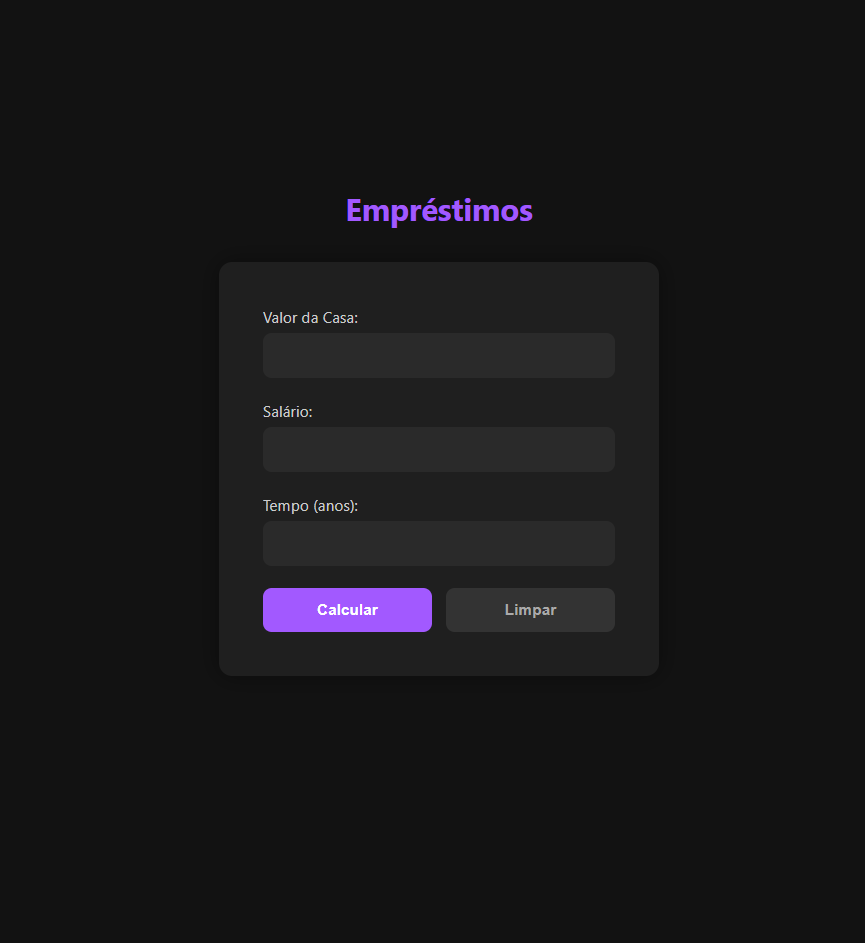

# Projeto Simples de Empréstimo com Flask

Este é um projeto de estudo, onde refiz um exercício antigo utilizando o framework Flask.
O objetivo é calcular se um empréstimo pode ser aprovado com base no valor da casa, salário do usuário e tempo de pagamento.

## Funcionalidades

- Interface web simples para simular empréstimo
- Cálculo automático da parcela mensal
- Aprovação ou recusa do empréstimo conforme regra de 30% do salário

## Estrutura do Projeto

```
app/
├── routes/
│   └── views.py
│
├── static/
│   ├── css/
│   └── js/
│
├── templates/
│   └── index.html
│
main.py
```

## Imagem do projeto

